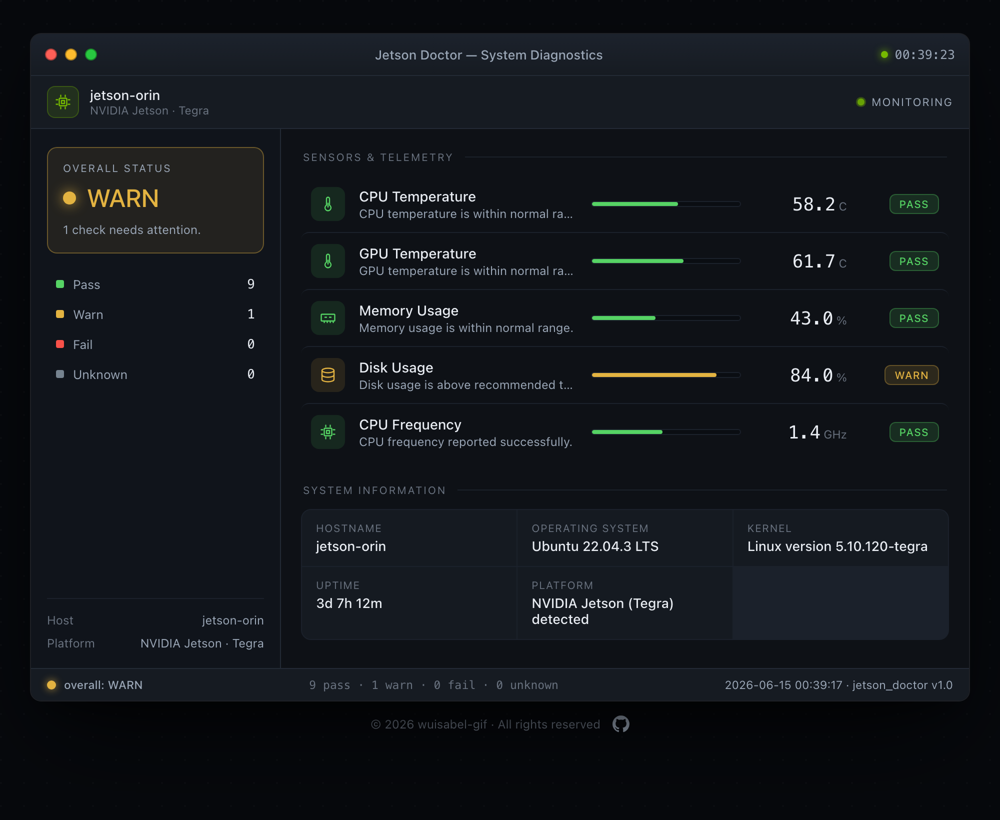
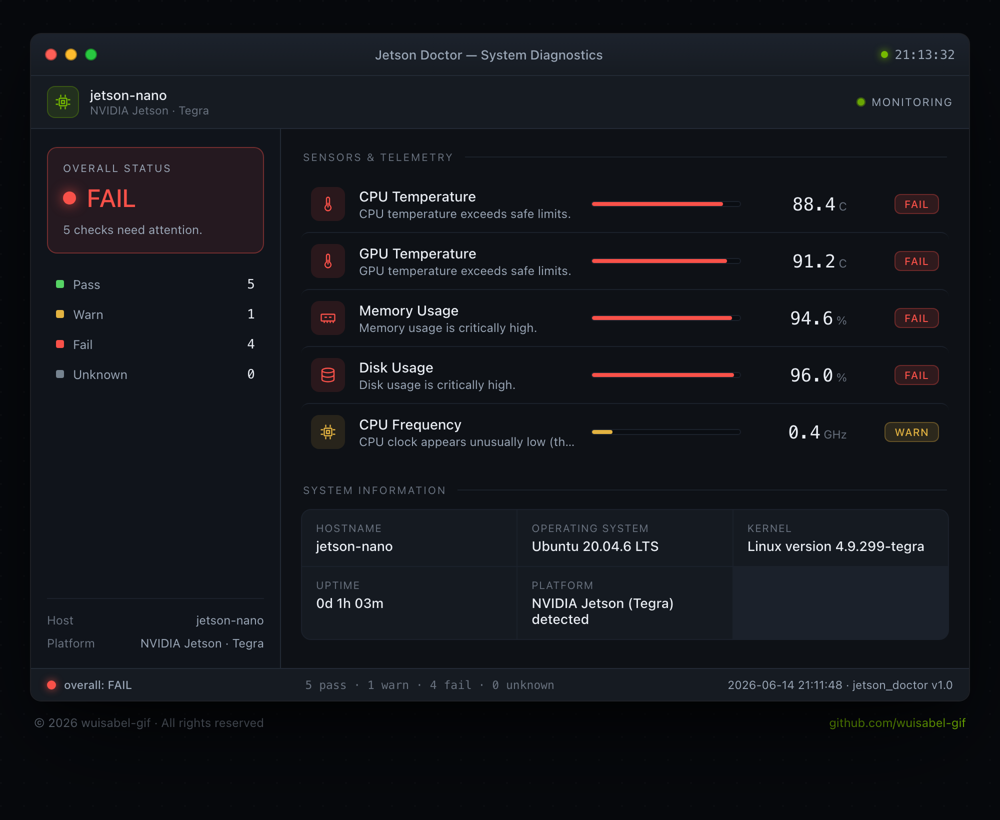

# Jetson Doctor

> Jetson Doctor is a C++ Linux diagnostic utility that monitors thermal, memory, disk,
> and compute health on NVIDIA Jetson platforms and generates PASS/WARN/FAIL reports for
> bring-up, validation, and failure analysis.



<sub>The generated HTML report, styled as a desktop system monitor (the `warning`
scenario). Reproduce it with `./build/jetson_doctor --demo --html`.</sub>

### 🔴 Live demo

**[View the interactive demo →](https://wuisabel-gif.github.io/jetson_doctor/)** — switch
between four health scenarios to see how the report responds across the status spectrum:

| Scenario | Overall | What it shows |
|----------|---------|---------------|
| `healthy`   | **PASS**    | Everything nominal |
| `warning`   | **WARN**    | One metric over threshold (disk) |
| `critical`  | **FAIL**    | Thermal / resource crisis with CPU throttling |
| `nonjetson` | **UNKNOWN** | Generic Linux host with no thermal sensors |

The same report in a failing state:



<sub>Generate any scenario with `./build/jetson_doctor --demo <scenario> --html`.</sub>

## What it is

**Jetson Doctor** is a command-line hardware diagnostic monitor written in modern C++17.
It reads platform health information directly from the Linux kernel interfaces (`sysfs`
and `procfs`), evaluates each metric against documented thresholds, and produces a clear
**PASS / WARN / FAIL** verdict — in the terminal, as a styled HTML report, and as
structured JSON.

It is designed around the realities of hardware bring-up and platform diagnostics: a
sensor may not exist on every board, a file may not be readable, and the tool must never
crash or require root. Missing data is reported as `UNKNOWN`, not treated as failure.

## Why it matters

During hardware bring-up and validation, engineers need a fast, repeatable way to answer
"is this board healthy?" without manually `cat`-ing a dozen kernel files. Jetson Doctor
packages that workflow into a single command with machine-readable output suitable for
automated test benches and failure triage.

### Relevance to NVIDIA system software diagnostics

This project mirrors the core concerns of data-center and embedded platform diagnostics:

- **C/C++ system programming** against raw Linux kernel interfaces
- **Hardware monitoring** of thermal, memory, disk, and clock domains
- **Diagnostic middleware design** — a clean `SystemMonitor` → `DiagnosticResult` →
  `ReportGenerator` pipeline
- **Bring-up style validation** with explicit PASS/WARN/FAIL thresholds
- **Failure analysis** via structured JSON logs and CI-friendly exit codes
- **Graceful degradation** so one diagnostic suite runs across heterogeneous hardware

## Metrics collected

| Metric          | Source                                                       |
|-----------------|-------------------------------------------------------------|
| CPU temperature | `/sys/class/thermal/thermal_zone*/temp`                     |
| GPU temperature | `/sys/class/thermal/thermal_zone*/temp` (GPU-therm zones)   |
| Memory usage    | `/proc/meminfo` (`MemTotal` vs `MemAvailable`)              |
| Disk usage      | `statvfs("/")`                                               |
| CPU frequency   | `/sys/devices/system/cpu/cpu*/cpufreq/scaling_cur_freq`     |
| Uptime          | `/proc/uptime`                                              |
| Kernel version  | `/proc/version`                                             |
| OS info         | `/etc/os-release`                                           |
| Hostname        | `gethostname()`                                            |
| Jetson detect   | `/etc/nv_tegra_release`                                     |

### Thresholds

```text
CPU / GPU temperature:   PASS < 75 C   WARN 75–85 C   FAIL > 85 C
Memory usage:            PASS < 75%    WARN 75–90%    FAIL > 90%
Disk usage:              PASS < 80%    WARN 80–90%    FAIL > 90%
```

## Building

Requires a C++17 compiler and CMake ≥ 3.10. **No root access required.**

```bash
cmake -S . -B build
cmake --build build
```

The binary is produced at `build/jetson_doctor`.

## Running

```bash
./build/jetson_doctor            # terminal report (default)
./build/jetson_doctor --html     # write reports/latest_report.html
./build/jetson_doctor --json     # write logs/latest_report.json
./build/jetson_doctor --all      # terminal + HTML + JSON
./build/jetson_doctor --watch 2  # refresh terminal report every 2s
./build/jetson_doctor --demo            # sample data (default: warning scenario)
./build/jetson_doctor --demo critical   # sample data, specific scenario
./build/jetson_doctor --help            # usage
```

> `--demo [scenario]` fills the report with representative sample data instead of reading
> live sensors. Scenarios: `healthy`, `warning`, `critical`, `nonjetson`. It's how the
> screenshots and [live demo](https://wuisabel-gif.github.io/jetson_doctor/) are produced,
> and it's handy for demos on a non-Jetson machine where live sensors read `UNKNOWN`.

The process exit code mirrors overall health (`0` = PASS/UNKNOWN, `1` = WARN, `2` = FAIL),
so it drops straight into CI pipelines and test scripts.

### Example output

The HTML report (see the [screenshot above](docs/screenshot.png)) is the human-facing
surface. The same run also prints to the terminal:

```text
Jetson Doctor Diagnostic Report
--------------------------------
2026-06-14 19:45:00

CPU Temperature:    58.2 C          PASS
GPU Temperature:    61.7 C          PASS
Memory Usage:       43.0 %          PASS
Disk Usage:         84.0 %          WARN  — Disk usage is above recommended threshold.
CPU Frequency:      1.4 GHz         PASS

Overall Status: WARN
```

## Architecture

```text
jetson-doctor/
├── CMakeLists.txt
├── README.md
├── AGENT.md
├── src/
│   ├── main.cpp                # CLI parsing + orchestration
│   ├── diagnostic_status.hpp   # PASS/WARN/FAIL/UNKNOWN enum + helpers
│   ├── diagnostic_result.hpp   # one diagnostic row
│   ├── system_monitor.hpp/.cpp # reads sysfs/procfs, applies thresholds
│   └── report_generator.hpp/.cpp # terminal / HTML / JSON rendering
├── reports/                    # generated HTML reports
├── logs/                       # generated JSON / CSV logs
└── docs/                       # GitHub Pages site
    ├── index.html              # interactive demo gallery (scenario tabs)
    ├── healthy.html … nonjetson.html  # one generated report per scenario
    └── screenshot*.png         # report previews used in this README
```

The design separates **collection** (`SystemMonitor` produces `DiagnosticResult`s) from
**presentation** (`ReportGenerator` renders them). Adding a new metric or output format is
a localized change.

## Future improvements

- CSV logging (`--csv`) for long-running trend capture
- Lightweight CPU stress mode to watch thermal response under load
- PCIe device summary via `lspci`
- Per-core temperature and per-rail power telemetry on Jetson
- Dockerfile + GitHub Actions build check for reproducible CI

---

*Built as a system-software diagnostics portfolio project. Runs on any Linux machine;
Jetson-specific sensors are used automatically when present.*
